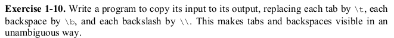

# Exercise 1.9



Like exercise 1.10 we have to break it down into smaller bits. Most people get confused whether the authors really meant __backspace__ or is it a typo for __blankspace__. It is a __backspace__ actually.

1. First of all we have to accept input from the user.
```c
while((c = getchar()) != EOF)
```
2. If the input is a tab character we replace it with a _\t_.
```c
if(c == '\t')
    printf("\\t");
```
3. Else if the input is a backspace we replace it with a _\b_.
```c
else if(c == '\b')
	printf("\\b");
```
3. Else if the input is a backslash we replace it with a _\\_.
```c
else if(c == '\\')
	printf("\\\\");
```
4. Else we print the input as it is.
```c
else
	putchar(c);
```
Right now you may be wondering how am I supposed to put a backspace in the terminal? Well in UNIX-like systems you can put a backspace with the combination Ctrl+H.

### Have fun programming!
