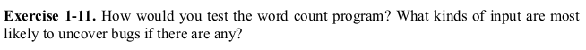

# Exercise 1.11



For this exercise we don't have to write any code. Instead we have to find out bugs in the example _wordcount_ program sorce code.

As a matter of fact I have found one without even running the code. Let's examine a snippet:
```c
if (c == ' ' || c == '\n' || c = '\t')
```
Do you see the problem with this line? Well when we are comparing whether _c_ is a tab character or not, we are actually not comparing instead we are assigning. This program will not compile anyway.

### Have fun programming!
