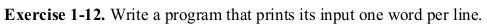

# Exercise 1.12

This is a fun and simple one. Let's break down the logic behind the solution:
1. First of all we have to accept input from the user until EOF is received.
1. Then we have to check the given input:
	1. if it is a blankspace or a tab, then we will print a newline character instead
	1. if it is anything other than a blankspace or a tab  then print it as it is

### Have fun programming!
