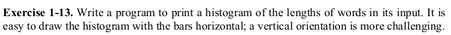

# Exercise 1.13



This is a challenging piece of exercise. But I was able to solve it by breaking it down into smaller bits.

Let's go through my algorithm for the horizontal histogram first:
1. First of all declare and initialize all the variables and an array of size _MAXLINE_, where _MAXLINE_ is the maximum number of word input we are expecting.
1. Then we accept input from the user until _EOF_ is received.
    1. If the given input is a blank space, a tab or a newline character then we move to the next word.
    ```c
    if(c == ' ' || c == '\t' || c == '\n')
        ++i;
    ```
    1. Else we increment the length of the current word by one.
    ```c
    else
        ++words[i];
    ```
1. Now our array holds the length of each and every word.
1. Printing is done by iterating over the array until the end is reached or the length of the word is zero.
```c
for(i = 0; i < MAXLINE && words[i] > 0; ++i)
{
    /*assign word length to c*/
	c = words[i];
	/*print * the word's length times*/
	while(c > 0)
	{
		putchar('*');
		--c;
	}
	/*newline after every horizontal column*/
	putchar('\n');
}
```

Now time for some vertical action:
1. Same as horizontal one.
1. Almost same as horizontal histogram except a variable now hold the value of the maximum word length. This will tell us the maximum height of the vertical bar. In my code the variable _j_ contains the maximum length word.
```c
/*accept input until EOF is received*/
while((c = getchar()) != EOF)
{
	/*if a blankspace, a tab or a newline is received,
	 *a new word starts*/
	if(c == ' ' || c == '\t' || c == '\n')
	{
		/*if the length of the previous word exceeds
		 *the current maximum, update current maximum*/
		if(words[i] > j)
			j = words[i];
		++i;
	}
	/*else increment the length of the current word*/
	else
		++words[i];	
	}
```
1. Now we will iterate _j_ times or the maximum word length times. And inside that loop we will nest another loop that will iterate over our word length array. If the length of the current word is greater than or equal to value of the parent loop then we print a _*_.
```c
/*iterate maximum word length times*/
for(i = j; i > 0; --i)
{
	/*iterate over each word*/
	for(j = 0; j < MAXLINE && words[j] > 0; ++j)
	{
		/*if the length of the word greater than the
		 *current value of variable i, print a **/
		if(words[j] >= i)
			putchar('*');
		/*else leave a blankspace*/
		else
			putchar(' ');
	}
	/*newline marks the end of a row*/
	putchar('\n');
}
```

I hope I was able to clear your doubts and explain the logic behind this solution clearly.

### Have fun programming!
