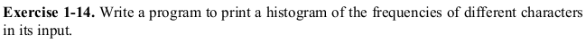

# Exercise 1.14



Okay! Now we are moving towards the _not-so-easy_ zone. Here goes my algorithm to solve this problem with code snippet:
1. First of all I define an array _words_ of size 95. Why 95? Because that's the number of printable characters we have in ASCII. We initialize the whole array with 0.
1. We accept input until EOF is received. For every character we can find its index in our array by subtracting it by _' '_, as blank space is the first printable character. It's binary value is _00100000_. Let's say we input _I_. _I_ has a binary value of _01001001_. So if we subtract _blankspace_ from _I_ we get _0101001_, which when converted to decimal gives us _41_. And that's the index of _I_ in our array. So we increment it by one.
```c
/*accept input until EOF is received*/
while((c = getchar()) != EOF)
{
	/*input character - ' ' gives us the index of the
	 *input character in our array*/
	++words[c - SPACE];
}
```
1. At the time of printing we simply iterate over our array and print only those characters which exist in the input.
```c
/*print out the histogram*/
printf("This is a histogram of the frequency of the characters in alphabatic order:\n");
for(i = 0; i < MAXCHAR - 1; ++i)
{
	/*print only if input exists*/
	if(words[i] > 0)
	{
		/*print the character first*/
		putchar(SPACE + i);
		/*then a SPACE!*/
		putchar(SPACE);
		/*then print the * character*/
		for(c = words[i]; c > 0; --c)
			putchar('*');
		/*a newline to separate*/
		putchar('\n');
	}
}
```

Here's a sample output for the input __I AM IRON MAN!__:
```c
  ***
! *
A **
I **
M **
N **
O *
R *
```
### Have fun programming!
