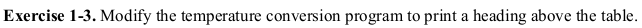

# Exercise 1.3

The exercise 1.3 is a simple yet effective problem to get you coding in the C programming language. The objective here is to print a header above the already given Fahrenheit to Celsius temperature converter program.

We can very easily accomplish this by writing a _printf()_ function call before we enter the _while_ loop. In my solution I have supplied the _printf()_ function with a string _"F\tC\n"_. All this does is prints the character _F_ for Fahrenheit, then a  _\t_ for tab, followed by the character _C_ for Celsius and finally _\n_ for newline character. 
