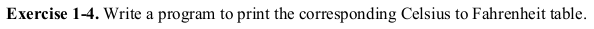

# Exercise 1.4



The exercise 1.4 gives us a wonderful opportunity to practice hands on what we have learned so far regarding variables, loops etc.

Inside the _cel2fahr.c_ program I have written something like this:

```c
fahr = 9.0 * celsius / 5.0 + 32.0;
```

At first it may look a bit daunting but trust me it is easier to evaluate than it looks. Actually I did a bit of forward reading to come up with an expression like this. The thing is each and every operator in C has its own precedence. That means every C operator has a priority value and also associativity, or how that priority is evaluated. Multiplication(\*) and division(/) operators have the same precedence and they are evaluated from left to right. Whereas the addition(+) operator has a lower precedence, and it is also evaluated from left to right.

So if we break it down into a series of steps assuming the value of variable celsius as 20:
1. (9.0 * 20.0) / 5.0 + 32.0
2. (180.0 / 5.0) + 32.0
3. 36.0 + 32.0
4. 68.0

Also you will notice I have tried to write a comment regarding each and every line of the code. Commenting is a good practice and using this exercises to sharpen my commenting skill will be very beneficial for me as well as you. 

### Have fun programming!
