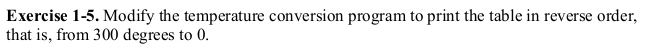

# Exercise 1.5

Exercise 1.5 provides us with an opportunity to learn more about variables and the _for_ loop. The program is already given in the book. All we are asked to do is reverse the output.

As discussed a _for_ loop has three parts:
1. initialization(_fahr = 300_): Here the _fahr_ variable is initialized to 300. Because we want to convert from 300F down to 0F.
2. condition(_fahr >=0_): In this section we check whether the variable _fahr_ has reached 0F or not.
3. increment/decrement(_fahr = fahr - 20_): We decrement _fahr_ by 20 each iteration.

The _for_ loop is a compact alternative to the _while_ loop.

### Have fun programming!
