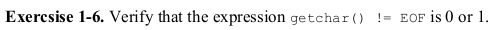

# Exercise 1.6



Exercise 1.6 is a great example to give a brief overview of operator precedence in C.

The not equals(_!=_) operator has a greater precedence than the assignment(_=_) operator. So if instead of writing:
```c
(c = getchar()) != EOF
```
we end up writing:
```c
c = getchar() != EOF
```
the results will be completely different. In the first code snippet variable _c_ will hold the value of the input passed to the terminal. Whereas in the second code snippet the variable _c_ will hold the either 1 or 0. If the passed character input is not _EOF_ then it holds the value 1 and vice versa. In the second snippet the _!=_ is evaluated before _=_.

### Have fun programming!
