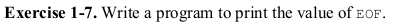

# Exercise 1.7



This is a very simple exercise. All we are asked to do is print out the value of _EOF_. We can do this very easily by:
```c
printf("Value of EOF: %d\n", EOF);
``` 
We have to keep in mind that _EOF_ can be a value which may not fit within a _char_ datatype. So in the book we are advised to use the _int_ datatype instead. For me the value of _EOF_ is -1.

### Have fun programming!
