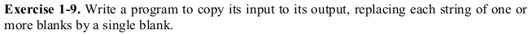

# Exercise 1.9



Again a very simple problem. We have to break the problem down into smaller bits to come at a solution.

1. First of all we have to accept input from the user.
```c
while((c = getchar()) != EOF)
```
2. The exercise asks us to replace multiple blank spaces with singletons. That implies we will print all the other characters as it is.
```c
if(c != ' ')
{
	putchar(c);
	nb = 0;
}
```
3. But if we get a blank space will print it if and only if the previous character was a not a blank. And we can keep a track of that using a counter variable. We have declared it with the name _nb_.
```c
else if(c == ' ' && nb == 0)
{
	putchar(c);
	++nb;
}
```

### Have fun programming!
